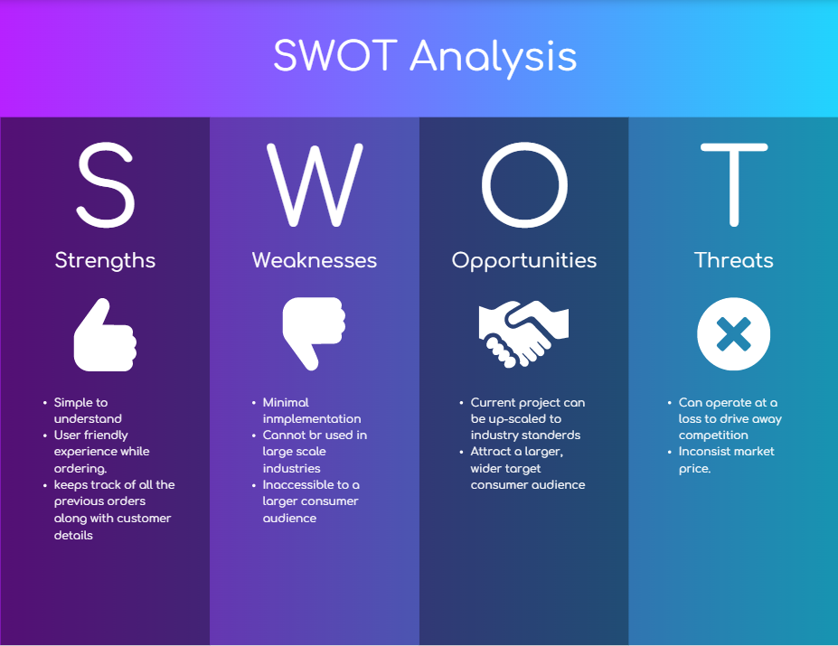

## Requirements
### Introduction
 Food Order Management System is based on the concept of ordering food and managing employee records. There’s no login system available for this system, the user can freely use its feature. This application has two categories; Admin section and customer section. Admin section, from where the user can manage employee and customer section, from where a user can order food. This mini project contains limited features, but the essential one.
 
Talking about the features of this Simple system, the user can simply order foods by selecting food items, entering a customer name, quantity. From the admin section, the user can manage records and can also view the last orders of the customers.

The system does not create an external file to store the user’s data permanently. This system is developed using C Programming Language and different variables, strings have been used for the development of it. 

### Scope

The Scope of the project are as follows: Food Ordering app can sale Food product, preferred brands, kitchen needs, essential restaurant supplies and more, through this online, one- stop Food store.

### SWOT Analysis

### 4W's and 1H 

**Who** :
    The user can be anyone who is hungry and interested to order food online.
    
**What** :
    Online food ordering demo with quick acccess to orders placed, different menu's and convinient wat of food ordering process.
    
**When** :
    The first online food ordering service, World Wide Waiter (now known as Waiter.com), was founded in 1995. The site originally serviced only northern California, later expanding to several additional cities in the United States.
    
**Where** :
    Advertising the restaurant and help in handy for food orders.
    
**How** :
- Select the feature to be executed.
- Select the respective operations to be done.
- Toggle back if necessary.

### High Level Requirements

| ID | Description | Status |
| --- | --- | --- |
| HL01 | User shall be displayed the featuers | Implemented |
| HL02 | User shall be able to select the featuers | Implemented |
| HL03 | User shall be able to view order details. | Implemented |
| HL04 | User shall be able to order food. | Implemented |

### Low Level requirements

| ID | Description | HLR ID | Status (Implemented/Future) |
| ------ | --------- | ------ | ----- |
| LR01 | User shall be asked to provide basic details like Name,Phone number,Address and Landmark.| HR04 |  IMPLEMENTED  |
| LR02 | User shall be asked to select the food from the menu and asked if to generate the bill| HR04 |  IMPLEMENTED  |

