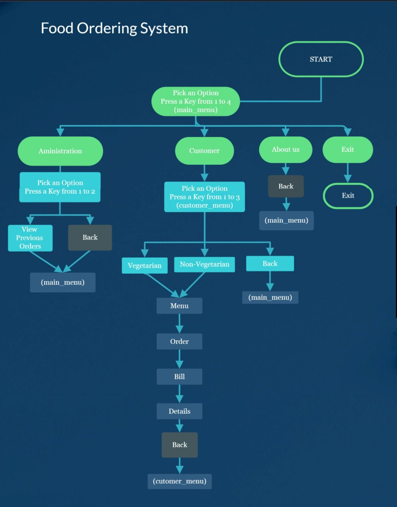

# Design

### Complete Design

#### Component Diagram :

### Introduction
 Food Order Management System is based on the concept of ordering food and managing employee records. There’s no login system available for this system, the user can freely use its feature. This application has two categories; Admin section and customer section. Admin section, from where the user can manage employee and customer section, from where a user can order food. This mini project contains limited features, but the essential one.
 
Talking about the features of this Simple system, the user can simply order foods by selecting food items, entering a customer name, quantity. From the admin section, the user can manage records and can also view the last orders of the customers.

The system does not create an external file to store the user’s data permanently. This system is developed using C Programming Language and different variables, strings have been used for the development of it. 

Features: 

1. Order Food
2. View orders
3. About us